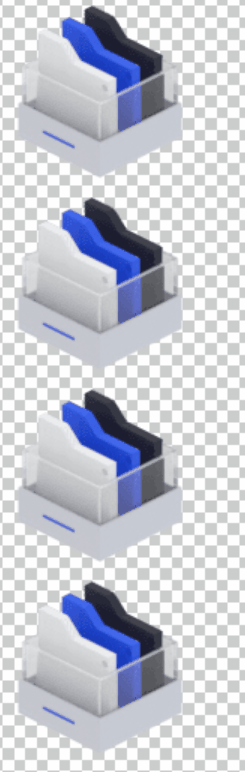

<p align="center" style="margin:30px 0;">
  <a href="#">
    
  </a>
  <div align="center">一个面向 Web 开发者和美术，零门槛，高还原度，快速上手的3D资产调优工作台</div>  
</p>


<p align="center">  
    
    
    
    
    
    
    
<p>   

## 简介
3D Design是由UU跑腿效率工程团队发起的3D模型工具平台，核心功能基于高性能 Web 图形引擎 [Oasis](https://oasisengine.cn/) 实现。    
再次感谢蚂蚁技术团队的认可，[本项目现已被蚂蚁集团技术团队，收录到Oasis官方案例仓库中](https://github.com/oasis-engine/awesome)

[使用文档介绍](https://www.yuque.com/blindmonk/3ddesign)  |  [博文介绍](https://juejin.cn/post/7070497172533280782)

 

## 架构设计

> 定位3D模型调试和产出的流程，基于Oasis引擎实时渲染，快速生成。  

 

相对建模软件渲染提高`300%`的效率，质量折损`18%`以内

并且可以通过JS脚本控制动画或可停止动画交互。

  

也可以通过js写微交互脚本，下面是图标的交互案例

  


## 特性

- ✅Web3D调优：可视化配置，基于Oasis深度定制，移动端优先
- ✅拥抱PBR：[PBR材质](https://oasisengine.cn/0.6/docs/material-cn) 遵循能量守恒，符合物理规则，美术们只需要调整几个简单的参数，即使在复杂的场景中也能保证正确的渲染效果。
- ✅一键导图：支持导出不同尺寸的jpg、png图片
- ✅生成代码：支持自定义配置并生成代码片段，无缝嵌入Vue/React等框架中
- ✅导出配置：可以将调优后的配置导出，配合业务做深度交互
- ✅所见即所得：不再需要前端与UI反复的调整模型还原效果。
- ✅材质复用：美术再也不用担心调好的材质丢失了，享受摸鱼时光
  
 

## 安装
本地运行
1. 安装依赖
```shell
pnpm install
//or
yarn install 
```
2. 运行
```
npm run dev
```

[进入体验 😀](https://tobe-fe-dalao.github.io/3d-design/#/)

# 加入维护团队

| 标题 | 二维码 | 目前状态 |
| ---- | ---- | ----- |
| Oasis官方交流群 |  </br>「钉钉群 」 | 运营中                                                              |
| 3DD官方维护群                                              |  </br>「钉钉群 」                |      招募中    |
| 扫地盲僧公众号                                             |  </br>关注后回复「3DD」 | 运营中 |


# 开发计划
[Milestones](https://github.com/tobe-fe-dalao/3d-design/projects)  

# License
 [Apache-2.0](./LICENSE) © [MaleWeb](https://github.com/MaleWeb)

